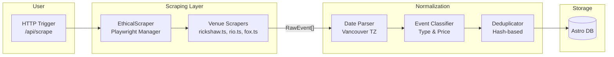

# Paper Bear Architecture

A local-first event aggregator for Vancouver venues, built with Astro and Playwright.

## High-Level Overview



## Data Flow

1.  **Trigger**: A `GET` request to `/api/scrape` initiates the process.
2.  **Scraper Init**: `EthicalScraper` launches a Playwright browser instance.
3.  **Venue Loop**: For each enabled venue in `src/config/venues.ts`:
    a.  The specific scraper (e.g., `rickshaw.ts`) navigates to the venue's calendar page.
    b.  It extracts raw event data (title, date strings, URLs).
    c.  For some venues, it visits each event's detail page to get door times and prices.
4.  **Normalization**:
    a.  `parseVancouverDate` converts raw date strings into `Date` objects in the `America/Vancouver` timezone.
    b.  If a doors time is found, it's combined with the calendar date.
    c.  `classifyEventType` tags events (music, comedy, etc.).
    d.  `parsePrice` extracts ticket prices.
5.  **Deduplication**: A hash (`MD5(venueId + date + title)`) is generated. Events with existing hashes are skipped.
6.  **Storage**: New, unique events are inserted into the `Event` table. A `ScrapeLog` entry is created for auditing.

## Key Technologies

| Component      | Technology                                       |
| :------------- | :----------------------------------------------- |
| **Framework**  | [Astro](https://astro.build/) (SSR via `@astrojs/node`) |
| **Database**   | [Astro DB](https://docs.astro.build/en/guides/astro-db/) (local LibSQL) |
| **Scraping**   | [Playwright](https://playwright.dev/)            |
| **Styling**    | Tailwind CSS + DaisyUI                           |

## Directory Structure

```
paper-bear/
├── db/
│   ├── config.ts       # Database schema definition (Venue, Event, ScrapeLog)
│   └── seed.ts         # Seeds initial venue data
├── src/
│   ├── config/
│   │   └── venues.ts   # Registry of enabled scrapers
│   ├── lib/
│   │   ├── utils/      # Date parsing, classification, scraper core
│   │   └── venues/     # Per-venue scraper implementations
│   └── pages/
│       ├── api/
│       │   └── scrape.ts # API endpoint that orchestrates scraping
│       └── index.astro   # Frontend event display
└── ...
```
