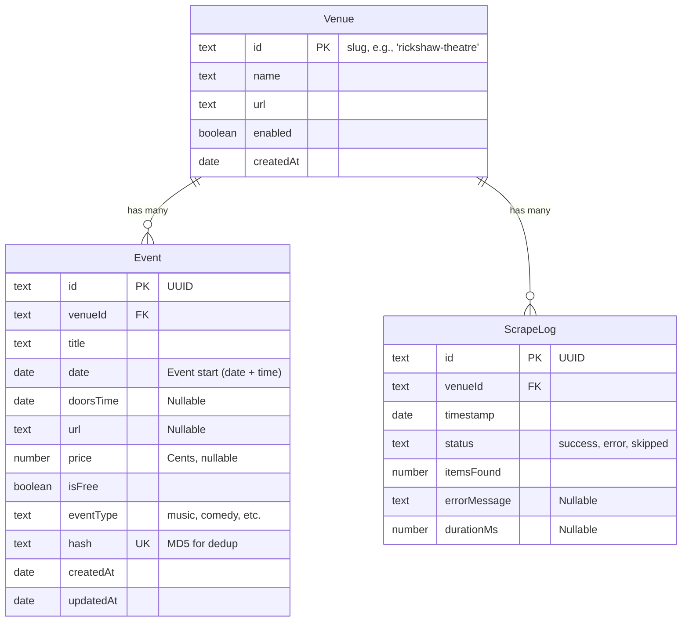

# Paper Bear Database Schema

The schema is defined using [Astro DB](https://docs.astro.build/en/guides/astro-db/) in [`db/config.ts`](file:///Users/jasonsanders/antigravity/paper-bear/db/config.ts).

## Entity Relationship Diagram

## Tables

### `Venue`
Configuration for each scraper. The `id` is a slug used as a foreign key and to identify the scraper module.

| Column      | Type      | Notes                          |
| :---------- | :-------- | :----------------------------- |
| `id`        | `text`    | **Primary Key**. Slug format.  |
| `name`      | `text`    | Display name.                  |
| `url`       | `text`    | Calendar URL to scrape.        |
| `enabled`   | `boolean` | Controls if scraper runs.      |
| `createdAt` | `date`    | Timestamp.                     |

### `Event`
The core data model for scraped events.

| Column      | Type      | Notes                                                                 |
| :---------- | :-------- | :-------------------------------------------------------------------- |
| `id`        | `text`    | **Primary Key**. UUID.                                                |
| `venueId`   | `text`    | **Foreign Key** to `Venue.id`.                                        |
| `title`     | `text`    | Event name. May include supporting acts.                              |
| `date`      | `date`    | **Event start**. Combines calendar date with doors time if available. |
| `doorsTime` | `date`    | Optional. Reserved for future use (currently `null`).                 |
| `url`       | `text`    | Link to event detail page.                                            |
| `price`     | `number`  | Ticket price in **cents**. `null` if unknown.                         |
| `isFree`    | `boolean` | `true` if explicitly free.                                            |
| `eventType` | `text`    | Enum: `music`, `comedy`, `theatre`, `screening`, `other`.             |
| `hash`      | `text`    | **Unique**. `MD5(venueId + date.toISOString() + title)`. See below.   |
| `createdAt` | `date`    | Timestamp.                                                            |
| `updatedAt` | `date`    | Timestamp.                                                            |

### `ScrapeLog`
Audit trail for each scraper run. Used for health monitoring.

| Column         | Type     | Notes                                   |
| :------------- | :------- | :-------------------------------------- |
| `id`           | `text`   | **Primary Key**. UUID.                  |
| `venueId`      | `text`   | **Foreign Key** to `Venue.id`.          |
| `timestamp`    | `date`   | When the scrape ran.                    |
| `status`       | `text`   | `success`, `error`, or `skipped`.       |
| `itemsFound`   | `number` | Count of events found by the scraper.  |
| `errorMessage` | `text`   | Error details if `status` is `error`.   |
| `durationMs`   | `number` | Scrape duration in milliseconds.        |

## Design Decisions

### Deduplication via `hash`
Events are deduplicated using a hash of `venueId`, `date` (ISO string), and `title`. This prevents the same event from being inserted on subsequent scrape runs. The hash is generated by `generateEventHash` in `scraper-core.ts`.

### Date Handling
All dates are parsed and stored assuming the `America/Vancouver` timezone. The `date` column stores the **event start time**. If the scraper finds a "Doors" time (e.g., "Doors: 7pm"), it is combined with the calendar date to create the final `date` value.

### Prices in Cents
Prices are stored as integers (cents) to avoid floating-point issues. A `null` price means the price is unknown; `isFree: true` explicitly marks free events.
